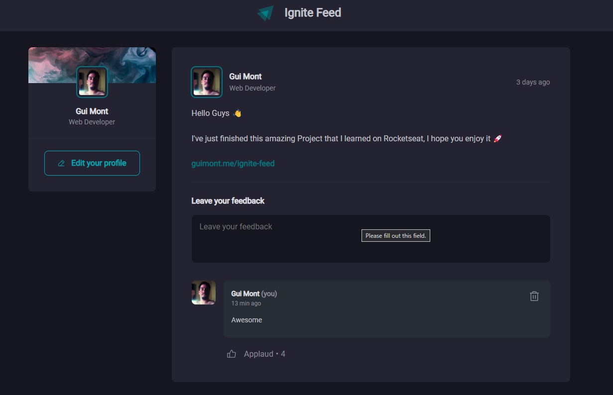

# Ignite Feed

It is a project of a post feed where some users can create comments and edit them. 

It's based on the Rocketseat Project [Ignite Feed](https://github.com/rocketseat-education/ignite-reactjs-01-fundamentos-react). 

## Stacks used in this project

* React.js
* TypeScript
* Vite
* [Date-fns](https://date-fns.org/)
* [Phosphor icons](https://phosphoricons.com/)

